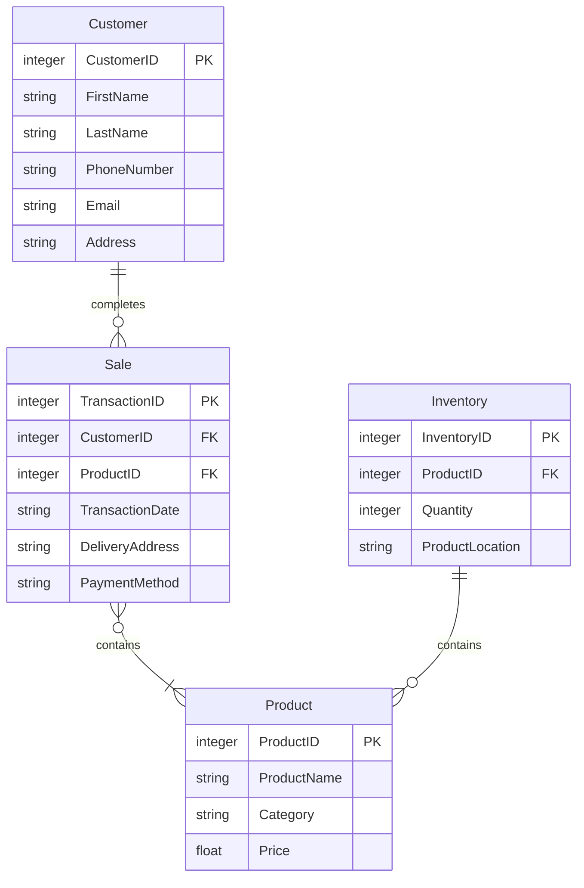

Entity Relationships and How They Support the Business

The customer completes a sale: This relationship helps the store keep track of a customer's transaction information and can help determine which product was purchased, when it was placed, where it was delivered, and what form of payment was used. The transaction ID or customer ID can later be used to pull up and look back on transactions. The transaction ID can also be used to differentiate between multiple sales under one customer ID.

The sale contains the product: This relationship determines which products were contained in a transaction and helps the store locate details about those products when needed. The product ID also helps differentiate between multiple products contained in one sale. This can be helpful if customer service or returns are needed further down the line.

The inventory contains the product: This relationship shows how much of a certain product is in stock and where it can be found. This will help stores understand what stock is available for them to sell and if it is available at certain stores or warehouses. This will lead to better organization of products and prevent under or over selling a product.
